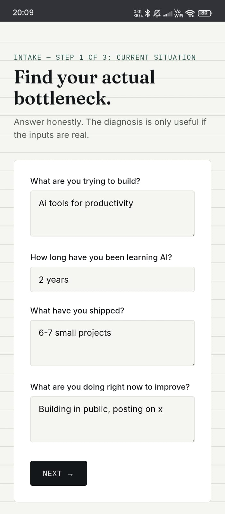
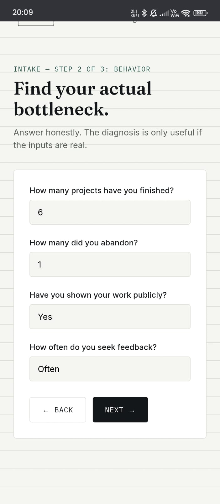
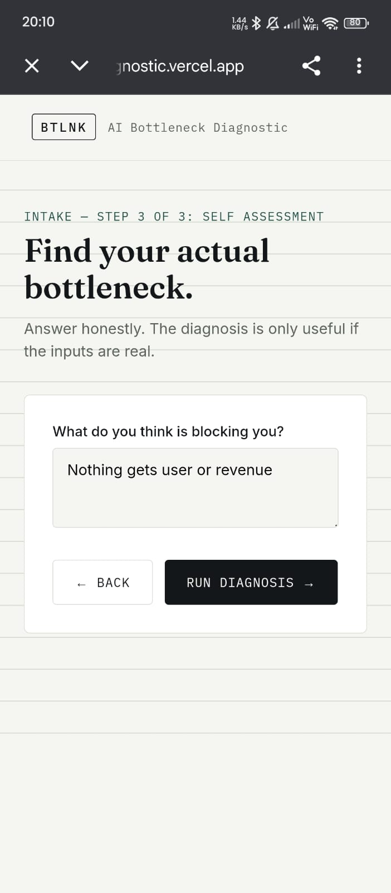
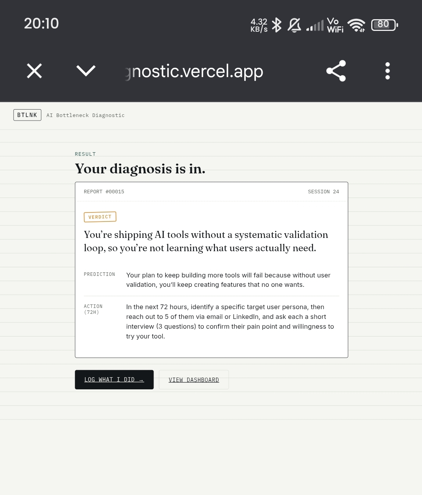
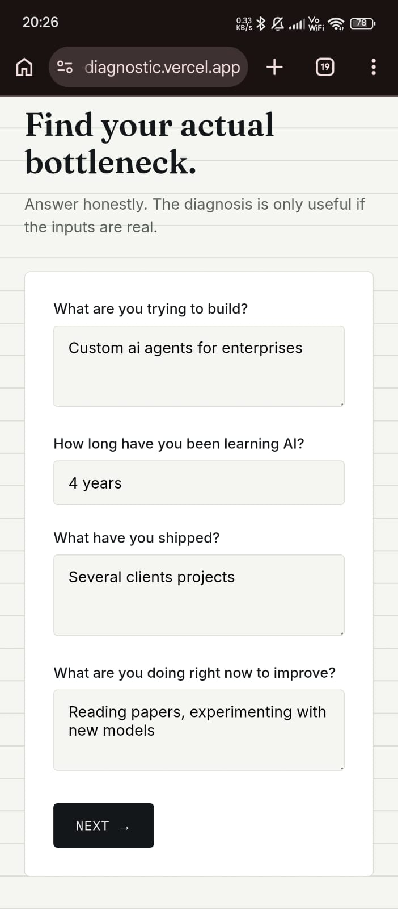
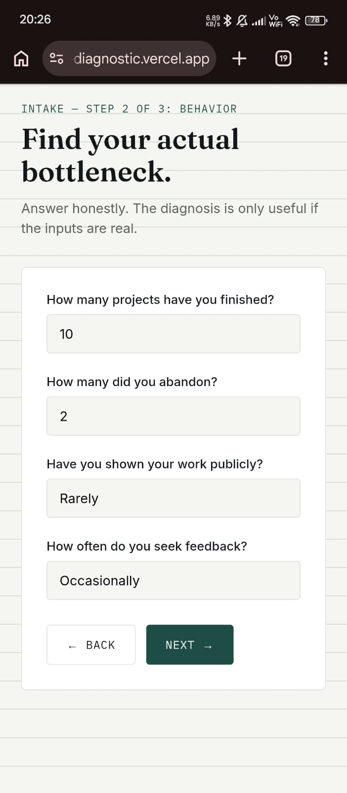
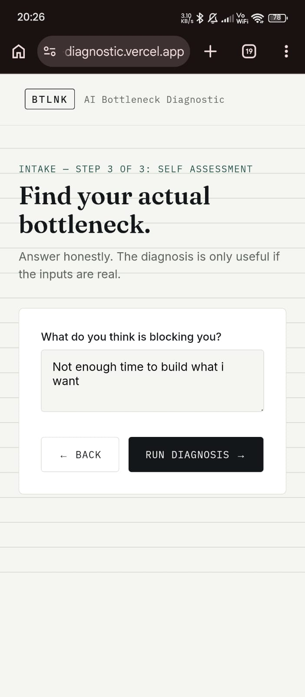
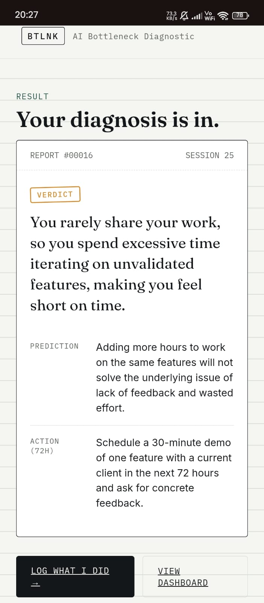
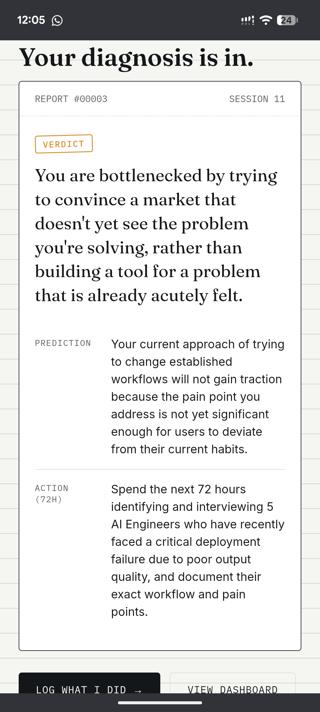

# MOVE 1 : BE THE TOOL YOURSELF

---

## Person 1

### Raw Record

Goal: Build a SaaS product using AI APIs  
Learning AI: 3 months  
Completed Projects: 0  
Started but unfinished projects: 4  
What they tried: Watching YouTube tutorials daily  
Why they think they are stuck: "I just need to learn more before I start."

### Evidence

  
  
  

### Diagnosis Sentence

Your bottleneck is not lack of AI knowledge. Your bottleneck is avoiding execution by staying in a tutorial loop. Another tutorial will not move you forward.

### Reaction

The user agreed that they had delayed building projects because they felt they needed more knowledge first.

### What They Did Next

Committed to finishing and publishing a project before taking another course.

---

## Person 2

### Raw Record

Goal: Build AI productivity tools that generate users and revenue  
Learning AI: 2 years  
Completed Projects: 6  
Started but unfinished projects: 1  
What they tried: Building in public, posting on X, launching multiple small projects  
Why they think they are stuck: "Nothing gets users or revenue."

### Evidence

  
  
  

### Diagnosis Sentence

Your bottleneck is not execution. You consistently ship projects. Your bottleneck is distribution and positioning. Building another project without understanding who it is for and how it reaches users will not solve the problem.

### Reaction

The user agreed that they spend most of their time building and very little time talking to users or validating demand before creating products.

### What They Did Next

Committed to interviewing potential users and focusing on distribution before starting another project.

---

## MOVE IMAGE

