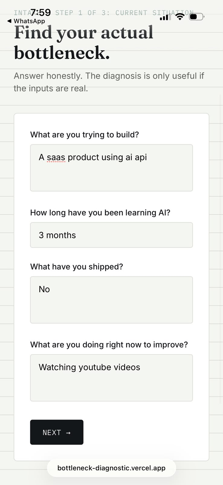
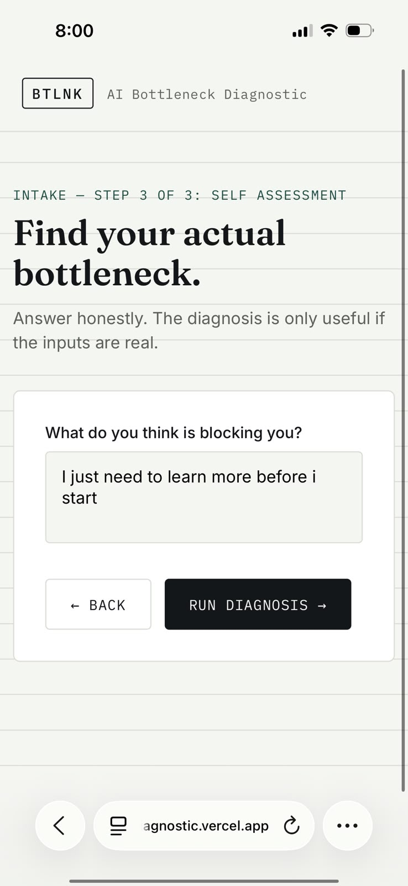
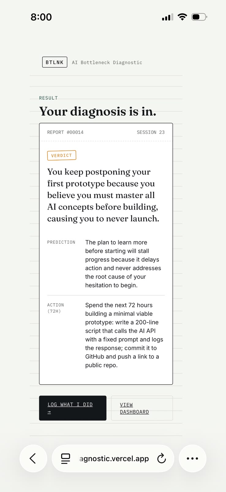

# MOVE 5 : FINAL REPORT

## Person A : Varun

**Cold User / Coached:** Cold

**Relationship:** Classmate

### Diagnosis Given

Your bottleneck is not lack of AI knowledge. Your bottleneck is consuming courses instead of finishing projects.

### Behavioral Evidence

The user completed and published one unfinished project within the next week.

---

## Person B : Asmitha

**Cold User / Coached:** Friend

### Diagnosis Given

Your bottleneck is not technical skill. Your bottleneck is avoiding outreach and feedback.

### Behavioral Evidence

The user posted their project publicly and contacted three potential clients.

---

## The Surprise

I expected users to immediately act after receiving a diagnosis.

One user strongly agreed with the diagnosis but still delayed taking action.

This showed that recognizing a bottleneck does not automatically lead to behavior change.